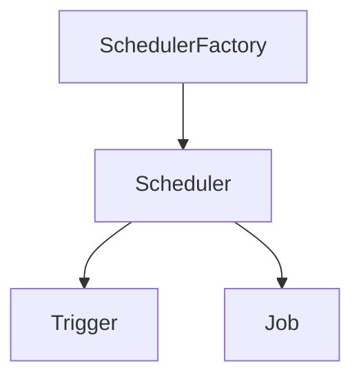

# 1、Quartz

## 1.1 引入依赖

```xml
<dependency>
    <groupId>org.quartz-scheduler</groupId>
    <artifactId>quartz</artifactId>
    <version>2.3.2</version>
</dependency>
<dependency>
    <groupId>org.quartz-scheduler</groupId>
    <artifactId>quartz-jobs</artifactId>
    <version>2.3.2</version>
</dependency>
```

## 1.2 入门案例

任务：将任务类执行 10 次，每次间隔 3 秒。

1. 任务类,需要实现 `Job` 接口

```java
package com.sugar.quartz.utils;

import org.quartz.Job;
import org.quartz.JobExecutionContext;
import org.quartz.JobExecutionException;

import java.text.SimpleDateFormat;
import java.util.Date;

/**
 * 功能描述: 任务
 *
 * @author XiaoNianXin
 * @date 2021/12/13 20:52
 */
public class HelloJob implements Job {

    @Override
    public void execute(JobExecutionContext context) throws JobExecutionException {
        // 获取当前时间,并格式化
        Date date = new Date();
        SimpleDateFormat format = new SimpleDateFormat("yyyy-MM-dd HH:mm:ss");
        String dateSrting = format.format(date);
        // 业务功能模拟
        System.out.println("开始备份数据库,时间：" + dateSrting);
    }
}
```

2. 定时器类

```java
package com.sugar.quartz.utils;

import org.quartz.*;
import org.quartz.impl.StdSchedulerFactory;

/**
 * 功能描述: 定时器配置
 *
 * @author XiaoNianXin
 * @date 2021/12/13 21:08
 */
public class HelloSchedulerDemo {
    public static void main(String[] args) throws SchedulerException {
        // 1、调度器 - 从工厂获取调度实例
        Scheduler scheduler = StdSchedulerFactory.getDefaultScheduler();

        // 2、任务实例 - 执行的任务对象
        JobDetail job = JobBuilder.newJob(HelloJob.class)
                .withIdentity("job1", "group1") // 任务名称,组名称
                .build();

        // 3、触发器 - 控制执行次数和执行时间
        Trigger trigger = TriggerBuilder.newTrigger()
                .withIdentity("trigger1", "group1") // 同上
                .startNow() // 立刻启动
                .withSchedule(SimpleScheduleBuilder.simpleSchedule().
                        withIntervalInSeconds(3).
                        withRepeatCount(10))   // 循环10次,每次间隔3s
                .build();

        // 调度器关联触发器,并启动
        scheduler.scheduleJob(job,trigger);
        scheduler.start();
    }
}
```

## 1.3 Job 与 JobDetail

Job：基于反射的任务调度接口，所有任务类都要实现该接口，在接口的 `execute` 里编写自己的业务逻辑。


Job 生命周期：每次执行 Job，在 execute 方法前会`创建新的 Job实例`，调用后实例被释放，再被GC回收。


JobDetail：封装 Job，给 Job 实例提供许多属性。


JobDetail 属性：name、group、jobClass、jobDataMap。


## 1.4 JobExecutionContext

下文将 JobExecutionContext 简称为 JEC


JEC ：当调度器调用 Job 时，会将 JEC 传递给 Job 的 execute 方法。


JEC 作用：Job 通过 JEC 获取运行环境信息，以及 Job 信息。


## 1.5 JobDataMap

下文将 JobDataMap 简称为 JDM


JDM：任务调度时，JDM 存储在 JEC 中，方便获取。


JDM 优点：实现 Map 接口，可以存取任何可序列化对象，Job 执行时会将参数传给 JDM。


1、手动获取 JDM 参数案例

HelloSchedulerDemo：

```java
package com.sugar.quartz.utils;

import org.quartz.*;
import org.quartz.impl.StdSchedulerFactory;

/**
 * 功能描述: 定时器配置
 *
 * @author XiaoNianXin
 * @date 2021/12/13 21:08
 */
public class HelloSchedulerDemo {
    public static void main(String[] args) throws SchedulerException {
        // 1、调度器 - 从工厂获取调度实例
        Scheduler scheduler = StdSchedulerFactory.getDefaultScheduler();

        // 2、任务实例 - 执行的任务对象
        JobDetail job = JobBuilder.newJob(HelloJob.class)
                .withIdentity("job1", "group1") // 任务名称,组名称
                .usingJobData("msg","JDM使用 - Detail")    // JDM 传递参数
                .build();

        // 3、触发器 - 控制执行次数和执行时间
        Trigger trigger = TriggerBuilder.newTrigger()
                .withIdentity("trigger1", "group1") // 同上
                .startNow() // 立刻启动
                .withSchedule(SimpleScheduleBuilder.simpleSchedule().
                        withIntervalInSeconds(3).
                        withRepeatCount(10))   // 循环10次,每次间隔3s
                .usingJobData("msg","JDM使用 - Trigger")
                .build();

        // 调度器关联触发器,并启动
        scheduler.scheduleJob(job,trigger);
        scheduler.start();
    }
}
```

HelloJob：

```java
package com.sugar.quartz.utils;

import org.quartz.Job;
import org.quartz.JobDataMap;
import org.quartz.JobExecutionContext;
import org.quartz.JobExecutionException;

import java.text.SimpleDateFormat;
import java.util.Date;

/**
 * 功能描述: 定时业务功能
 *
 * @author XiaoNianXin
 * @date 2021/12/13 20:52
 */
public class HelloJob implements Job {

    @Override
    public void execute(JobExecutionContext context) throws JobExecutionException {
        // 获取当前时间,并格式化
        Date date = new Date();
        SimpleDateFormat format = new SimpleDateFormat("yyyy-MM-dd HH:mm:ss");
        String dateSrting = format.format(date);

        // 获取 JDM
        JobDataMap Detail_JDM = context.getJobDetail().getJobDataMap();
        JobDataMap Trigger_JDM = context.getTrigger().getJobDataMap();
        String detail_jdmString = Detail_JDM.getString("msg");
        String trigger_jdmString = Trigger_JDM.getString("msg");
        System.out.println("---------------------------------------------------");
        System.out.println("detail_jdmString = " + detail_jdmString);
        System.out.println("trigger_jdmString = " + trigger_jdmString);

        // 业务功能模拟
        System.out.println("开始备份数据库,时间：" + dateSrting);

        // 其他内容
        System.out.println("Job 运行时间：" + context.getJobRunTime());
        System.out.println("Job 当前运行时间：" + context.getFireTime());
        System.out.println("Job 下次运行时间：" + context.getNextFireTime());
        System.out.println("---------------------------------------------------");
    }
}
```

2、Job 类实现 JDM 参数的 Setter 方法，实例化时自动绑定参数

HelloJob：

```
// 实例化时自动绑定 JDM key对应的值
private String msg;

public void setMsg(String msg) {
    this.msg = msg;
}

// 获取 JDM
System.out.println(Trigger JDM ： " + msg);
```

问题：上文中 JobDetail 和 Trigger 中的 JDM 的 key 均为 `"msg"`，那此 msg 是哪一个？

E.g：遇到同名key，Trigger 会覆盖 JobDetail 的值，所以 msg 为 Trigger JDM 的值。


## 1.6 Job 状态

有状态 Job：多次调用 Job 期间，公用同一个 JDM。


有状态 Job：多次调用 Job 期间，每次新建一个新的 JDM。


1、有无状态 Job 区别案例

预期：无状态 count 输出永远为 1，有状态 count 输出累加。

HelloSchedulerDemo：

```
// JobDeatil 添加一个 JDM，用做计数器
.usingJobData("count",0)
```

无状态 HelloJob：

```
package com.sugar.quartz.utils;

import org.quartz.Job;
import org.quartz.JobExecutionContext;
import org.quartz.JobExecutionException;

import java.text.SimpleDateFormat;
import java.util.Date;

/**
 * 功能描述: 任务类
 *
 * @author XiaoNianXin
 * @date 2021/12/13 20:52
 */
public class HelloJob implements Job {

    // 实例化时自动绑定 JDM key对应的值
    private String msg;
    private Integer count;

    public void setMsg(String msg) {
        this.msg = msg;
    }

    public void setCount(Integer count) {
        this.count = count;
    }

    @Override
    public void execute(JobExecutionContext context) throws JobExecutionException {
        // 获取当前时间,并格式化
        Date date = new Date();
        SimpleDateFormat format = new SimpleDateFormat("yyyy-MM-dd HH:mm:ss");
        String dateSrting = format.format(date);

        // 获取 JDM
        System.out.println("---------------------------------------------------");
        System.out.println("Trigger JDM ： " + msg); 
        System.out.println("Count ： " + count);
        
        // 更新 JobDetail JDM 的 count
        count++;
        context.getJobDetail().getJobDataMap().put("count",count);

        // 业务功能模拟
        System.out.println("开始备份数据库,时间：" + dateSrting);

        // 其他内容
        System.out.println("Job 运行时间：" + context.getJobRunTime());
        System.out.println("Job 当前运行时间：" + context.getFireTime());
        System.out.println("Job 下次运行时间：" + context.getNextFireTime());
        System.out.println("---------------------------------------------------");
    }
}
```

有状态 HelloJob：

```
// 任务类加上下面注解，多次调用 Job，会持久化 Job，JDM 的数据会被保存，供下次使用
@PersistJobDataAfterExecution
```


## 1.7 Trigger

Trigger 常用：SimpleTrigger、CronTrigger。


JobKey：Job 实例标识，触发器触发时，执行 JobKey 对应任务。


StartTime：第一次触发时间。


EndTime：终止触发时间。


1、Trigger 获取参数案例

HelloSchedulerTriggerDemo：

```
package com.sugar.quartz.utils;

import org.quartz.*;
import org.quartz.impl.StdSchedulerFactory;

import java.util.Date;

/**
 * 功能描述: 定时器配置2
 *
 * @author XiaoNianXin
 * @date 2021/12/13 21:08
 */
public class HelloSchedulerTriggerDemo {
    public static void main(String[] args) throws SchedulerException {

        // 任务开始时间推迟 3 s,结束时间推迟 10 s
        Date startData = new Date();
        startData.setTime(startData.getTime() + 3000);
        Date endData = new Date();
        endData.setTime(endData.getTime() + 10000);

        // 1、调度器 - 从工厂获取调度实例
        Scheduler scheduler = StdSchedulerFactory.getDefaultScheduler();

        // 2、任务实例 - 执行的任务对象
        JobDetail job = JobBuilder.newJob(helloJobTrigger.class)
                .withIdentity("job1", "group1") // 任务名称,组名称
                .usingJobData("msg","JDM使用 - Detail")    // JDM 传递参数
                .build();

        // 3、触发器 - 控制执行次数和执行时间
        Trigger trigger = TriggerBuilder.newTrigger()
                .withIdentity("trigger1", "group1") // 同上
                .startNow() // 立刻启动
                .startAt(startData)
                .endAt(endData)
                .build();

        // 调度器关联触发器,并启动
        scheduler.scheduleJob(job,trigger);
        scheduler.start();
    }
}
```

helloJobTrigger：

```
package com.sugar.quartz.utils;

import org.quartz.Job;
import org.quartz.JobExecutionContext;
import org.quartz.JobExecutionException;
import org.quartz.PersistJobDataAfterExecution;

import java.text.SimpleDateFormat;
import java.util.Date;

/**
 * 功能描述: 任务类2
 *
 * @author XiaoNianXin
 * @date 2021/12/13 20:52
 */
@PersistJobDataAfterExecution
public class helloJobTrigger implements Job {

    @Override
    public void execute(JobExecutionContext context) throws JobExecutionException {
        // 获取当前时间,并格式化
        Date date = new Date();
        SimpleDateFormat format = new SimpleDateFormat("yyyy-MM-dd HH:mm:ss");
        String dateSrting = format.format(date);

        // 业务功能模拟
        System.out.println("---------------------------------------------------");
        System.out.println("开始备份数据库,时间：" + dateSrting);

        // 获取 JobKey,StartTime,EndTime
        System.out.println("JobKey ： " + context.getTrigger().getJobKey());
        System.out.println("StartTime ： " + format.format(context.getTrigger().getStartTime()));
        System.out.println("EndTime ： " + format.format(context.getTrigger().getEndTime()));
        System.out.println("---------------------------------------------------");
    }
}

// 运行结果
---------------------------------------------------
开始备份数据库,时间：2021-12-13 23:25:06
JobKey ： group1.job1
StartTime ： 2021-12-13 23:25:06
EndTime ： 2021-12-13 23:25:13
---------------------------------------------------
```


## 1.8 SimpleTripper

下文将 SimpleTripper 简称为 ST


ST：特定时间范围启动/结束，且以一个时间间隔重复 n 次 Job 所设计。


ST 属性：开始时间、结束时间、重复次数和时间间隔。


ST 提示：指定了结束时间，那么结束时间优先级 > 重复次数。


## 1.9 CronTrigger

下文将 CronTrigger 简称为 CT


CT：使用日历触发任务，CT 比 ST 更有用，它是基于日历的调度器。


Cron 表达式：由 7 个子表达式组成的字符串，每个描述单独日程细节，空格分隔。


Cron 格式：秒 分 小时 日 月 周 年（可选）


取值：

| 字段 | 必填 |     允许值      |    特殊字符     |
| :--: | :--: | :-------------: | :-------------: |
|  秒  |  是  |      0-59       |     ，- * /     |
|  分  |  是  |      0-59       |     ，- * /     |
| 小时 |  是  |      0-23       |     ，- * /     |
|  日  |  是  |      1-31       | ，- * / ? L W C |
|  月  |  是  | 1-12 或 JAN-DEC |     ，- * /     |
|  周  |  是  | 1-7 或 SUN-SAT  | ，- * / ? L C # |
|  年  |  否  | 无 或 1970-2099 |     ，- * /     |

| 特殊字符 | 含义         |
| -------- | ------------ |
| *        | 任意         |
| ？       | 无值日和周   |
| -        | 区间         |
| ，       | 枚举         |
| /        | 增量         |
| L        | 最后日和周   |
| W        | 最近的日     |
| #        | 月第几个周几 |


1、用 CronTrigger 每秒触发一次 Job

HelloCronTriggerDemo：

```java
package com.sugar.quartz.utils.trigger;

import com.sugar.quartz.utils.job.HelloJobCronTrigger;
import org.quartz.*;
import org.quartz.impl.StdSchedulerFactory;

/**
 * 功能描述: CronTrigger
 *
 * @author XiaoNianXin
 * @date 2021/12/14 20:37
 */
public class HelloCronTriggerDemo {
    public static void main(String[] args) throws SchedulerException {
        // 1、调度器 - 从工厂获取调度实例
        Scheduler scheduler = StdSchedulerFactory.getDefaultScheduler();

        // 2、任务实例 - 执行的任务对象
        JobDetail job = JobBuilder.newJob(HelloJobCronTrigger.class)
                .withIdentity("job1", "group1") // 任务名称,组名称
                .build();

        // 3、触发器 - 控制执行次数和执行时间
        Trigger trigger = TriggerBuilder.newTrigger()
                .withIdentity("trigger1", "group1") // 同上
                .startNow() // 立刻启动
                .withSchedule(CronScheduleBuilder.cronSchedule("* * * * * ?"))   // Cron 表达式
                .build();

        // 调度器关联触发器,并启动
        scheduler.scheduleJob(job,trigger);
        scheduler.start();
    }
}
```


# 2、任务调度

## 2.1 SchedulerFactory

下文将 SchedulerFactory 简称为 SF

SF 模型：



Trigger：驱动 Job，没有它有 Job 也无法使用。

Job：一个 Job 可以有多个 Trigger。


Scheduler 创建方式：

- 使用一组参数来`创建和初始化`调度器。
- 配置参数一班存储在 quartz.properties 文件中。
- 调用 `getScheduler` 得到调度器对象。

```java
创建 SF 对象，获得 Scheduler 
Scheduler scheduler = StdSchedulerFactory.getDefaultScheduler();
```

用法一：调度器开始时间

```java
Date date = scheduler.scheduleJob(job, trigger);
// 输出调度器开始时间
SimpleDateFormat dateFormat = new SimpleDateFormat("yyyy-MM-dd HH:mm:ss");
System.out.println("调度器开始时间 ： " + dateFormat.format(date));
```

用法二：启动任务调度

```java
scheduler.start();
```

用法三：任务调度暂停

```java
// 启动 2 s 后暂停
scheduler.start();
Thread.sleep(2000);
// 暂停 5 s 后重启
scheduler.standby();
Thread.sleep(5000);
// 重启
scheduler.start();
```

用法四：关闭任务调度

```java
// 关闭任务，true：等 Job 完成后再关闭；false：直接关闭
scheduler.shutdown(true/false);
```


## 2.2 Quartz.Properties

路径：Jar 包下 org.quartz 的 quartz.properties。

```properties
# Default Properties file for use by StdSchedulerFactory
# to create a Quartz Scheduler Instance, if a different
# properties file is not explicitly specified.

org.quartz.scheduler.instanceName: DefaultQuartzScheduler
org.quartz.scheduler.rmi.export: false
org.quartz.scheduler.rmi.proxy: false
org.quartz.scheduler.wrapJobExecutionInUserTransaction: false

org.quartz.threadPool.class: org.quartz.simpl.SimpleThreadPool
org.quartz.threadPool.threadCount: 10
org.quartz.threadPool.threadPriority: 5
org.quartz.threadPool.threadsInheritContextClassLoaderOfInitializingThread: true

org.quartz.jobStore.misfireThreshold: 60000
org.quartz.jobStore.class: org.quartz.simpl.RAMJobStore
```

我们可以在 `resources` 下添加 quartz.properties 覆盖底层文件。


组成：

1、调度器属性

instanceName：实例名称，用于区分。

instanceId：同上，必须唯一，设置为 AUTO 由 Quartz 自动生成。


2、线程池属性

threadCount：处理任务线程数，[1-100]，高于 100 不实用。

threadPriority：线程优先级，[1-10]，默认为 5 。


3、作业储存设置

调度器生命周期内，Job 和 Trigger 如何存储。


4、插件配置

## 2.3 Quartz 监听器

1、概念

当任务调度中，你`关注的事件发生时，及时通知`，比如邮件、短信。

全局监听器：接受所有 Job/Trigger 事件通知。

非全局监听器：只接受注册的 Job 或 Trigger 事件，类似 RabbitMQ。


2、JobListener

四大方法：

- getName 获取 JobListener 名称
- jobToBeExecuted 将要执行调用
- jobExecutionVetoed 将要执行，被触发器否决调用
- jobWasExecuted 执行结束调用

MyJobListener：

```java
package com.sugar.quartz.utils.listener;

import org.quartz.JobExecutionContext;
import org.quartz.JobExecutionException;
import org.quartz.JobListener;

/**
 * 功能描述: JobListener
 *
 * @author XiaoNianXin
 * @date 2021/12/15 18:38
 */
public class MyJobListener implements JobListener {
    /**
     * 获取实例名称
     * @return
     */
    @Override
    public String getName() {
        String name = this.getClass().getSimpleName();
        return name;
    }


    @Override
    public void jobToBeExecuted(JobExecutionContext context) {
        System.out.println("=============Detail 运行前=============");
    }

    @Override
    public void jobExecutionVetoed(JobExecutionContext context) {
        System.out.println("=============Trigger 否决=============");
    }

    @Override
    public void jobWasExecuted(JobExecutionContext context, JobExecutionException e) {
        System.out.println("=============Job 运行后=============");
    }
}
```

HelloJobListenerDemo：

```java
// 注册全局监听器
scheduler.getListenerManager().addJobListener(new MyJobListener(), EverythingMatcher.allJobs());
// 注册局部监听器
scheduler.getListenerManager().addJobListener(new MyJobListener(), KeyMatcher.keyEquals(JobKey.jobKey("job1","group1")));
```


3、TriggerListener

五大方法：

- getName
- triggerFired
- vetoJobExecution
- triggerMisfired
- triggerComplete

MyTriggerListener：

```java
package com.sugar.quartz.utils.listener;

import org.quartz.*;

/**
 * 功能描述: TriggerListener
 *
 * @author XiaoNianXin
 * @date 2021/12/15 18:38
 */
public class MyTriggerListener implements TriggerListener {

    @Override
    public String getName() {
        return this.getClass().getSimpleName();
    }

    @Override
    public void triggerFired(Trigger trigger, JobExecutionContext context) {
        System.out.println("============ 触发器触发 ============");
    }

    @Override
    public boolean vetoJobExecution(Trigger trigger, JobExecutionContext context) {
        System.out.println("============ 否决 Job 执行============");
        return false;
    }

    @Override
    public void triggerMisfired(Trigger trigger) {
        System.out.println("============ 错过触发 ============");
    }

    @Override
    public void triggerComplete(Trigger trigger, JobExecutionContext context, Trigger.CompletedExecutionInstruction completedExecutionInstruction) {
        System.out.println("============ 触发完成 ============");
    }
}
```

HelloTriggerListenerDemo：

```java
// 注册全局监听器
scheduler.getListenerManager().addTriggerListener(new MyTriggerListener(), EverythingMatcher.allTriggers());
// 注册局部监听器
scheduler.getListenerManager().addTriggerListener(new MyTriggerListener(), KeyMatcher.keyEquals(TriggerKey.triggerKey("job1","group1")));
```


4、SchedulerListener

十二大方法：

- jobScheduled
- jobUnScheduled
- triggerFinalized
- triggerPaused
- triggerResumed
- jobsPaused
- jobsResumed
- schedulerError
- schedulerStarted
- schedulerStandByMode
- schedulerShutdown
- schedulingDataCleared

MySchedulerListener：

```java
package com.sugar.quartz.utils.listener;

import org.quartz.*;

/**
 * 功能描述: SchedulerListener
 *
 * @author XiaoNianXin
 * @date 2021/12/15 18:38
 */
public class MySchedulerListener implements SchedulerListener {

    @Override
    public void jobScheduled(Trigger trigger) {
        System.out.println(trigger.getKey().getName() + "完成部署");
    }

    @Override
    public void jobUnscheduled(TriggerKey triggerKey) {
        System.out.println(triggerKey.getName() + "完成卸载");
    }

    @Override
    public void triggerFinalized(Trigger trigger) {
        System.out.println(trigger.getKey().getName() + "触发器移出");
    }

    @Override
    public void triggerPaused(TriggerKey triggerKey) {
        System.out.println(triggerKey.getName() + "触发器暂停");
    }

    @Override
    public void triggersPaused(String triggerGroup) {
        System.out.println(triggerGroup + "触发器组暂停");
    }

    @Override
    public void triggerResumed(TriggerKey triggerKey) {
        System.out.println(triggerKey.getName() + "触发器恢复");
    }

    @Override
    public void triggersResumed(String triggerGroup) {
        System.out.println(triggerGroup + "触发器组恢复");
    }

    @Override
    public void jobAdded(JobDetail jobDetail) {
        System.out.println(jobDetail.getKey().getName() + "任务被添加");
    }

    @Override
    public void jobDeleted(JobKey jobKey) {
        System.out.println(jobKey.getName() + "任务被删除");
    }

    @Override
    public void jobPaused(JobKey jobKey) {
        System.out.println(jobKey.getName() + "任务被暂停");
    }

    @Override
    public void jobsPaused(String jobGroup) {
        System.out.println(jobGroup + "任务组被暂停");
    }

    @Override
    public void jobResumed(JobKey jobKey) {
        System.out.println(jobKey.getName() + "任务被恢复");
    }

    @Override
    public void jobsResumed(String jobGroup) {
        System.out.println(jobGroup + "任务组被恢复");
    }

    @Override
    public void schedulerError(String msg, SchedulerException e) {
        System.out.println("scheduler发生严重错误" + msg + e.getUnderlyingException());
    }

    @Override
    public void schedulerInStandbyMode() {
        System.out.println("scheduler处于挂起状态");
    }

    @Override
    public void schedulerStarted() {
        System.out.println("scheduler处于开启状态");
    }

    @Override
    public void schedulerStarting() {
        System.out.println("scheduler处于正在开启状态");
    }

    @Override
    public void schedulerShutdown() {
        System.out.println("scheduler处于关闭状态");
    }

    @Override
    public void schedulerShuttingdown() {
        System.out.println("scheduler处于正在关闭状态");
    }

    @Override
    public void schedulingDataCleared() {
        System.out.println("scheduler处于数据清除状态");
    }
}
```

HelloSchedulerListenerDemo：

```java
// 注册全局监听器
scheduler.getListenerManager().addSchedulerListener(new MySchedulerListener());
// 注册局部监听器
scheduler.getListenerManager().addSchedulerListener(new MySchedulerListener());
```

